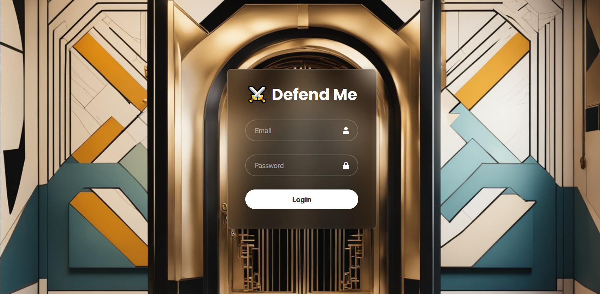

# ⚔️ Defend Me

## 📚 Table of Contents

1. [Description](#description)
2. [Functionality](#functionality)
    - [Login Screen](#login-screen)
3. [Developer Instructions](#developer-instructions)
    - [Local](#local)
        - [Windows (Bash)](#windows-bash)
4. [Credits](#credits)

## 📖 Description

This is a take-home project for a technical interview for a company.

This application is written in Python for the backend and React for the frontend.

## Functionality

A smartphone application that scans a fictional company's employee devices for known and unknown malware.

### 🔑 Login Screen

The user is greeted with a login screen. This prevents anyone from accessing the Defend Me enterprise dashboard as it contains [PII](https://en.wikipedia.org/wiki/Personal_data) such as employee name, email and sensitive information.



### Enterprise Dashboard

🚧 Work in progress 🚧

## 👩‍💻 Developer Instructions

### Local

#### 🖥️ Windows (Bash)

1. Ensure you have Node.js and npm installed in your machine. Check by running the following commands.

```
npm -v
```

```
node -v
```

If you do not have Node.js, install from [here](https://nodejs.org/en/download).

2. Ensure you have Python installed.

```
python --version
```

or

```
python3 --version
```

If you do not have Python, go ahead and install it from [here](https://www.python.org/).

3. Once you have Python installed, you will need these following Python packages. Run the following command to install them.

```
pip install sqlite Faker
```

4. Run the commands below to initialise the database with seeded data.

```
cd sql-database
```

```
python init_db.sql
```

or

```
python3 init_db.sql
```

5. Run the commands below to start the backend server.

```
cd flask-server/
```

```
python3 server.py
```

6. Run the commands below to install the dependencies for React and start the frontend in another bash terminal.

```
cd react-client/
```

```
npm install
```

```
npm start
```

#### MacOS

🚧 Work in progress 🚧

## Credits

1. [Deep AI Image Generator](https://deepai.org/machine-learning-model/text2img) for the login screen background.
2. [React Icons](https://react-icons.github.io/react-icons/) for icons used within the website.