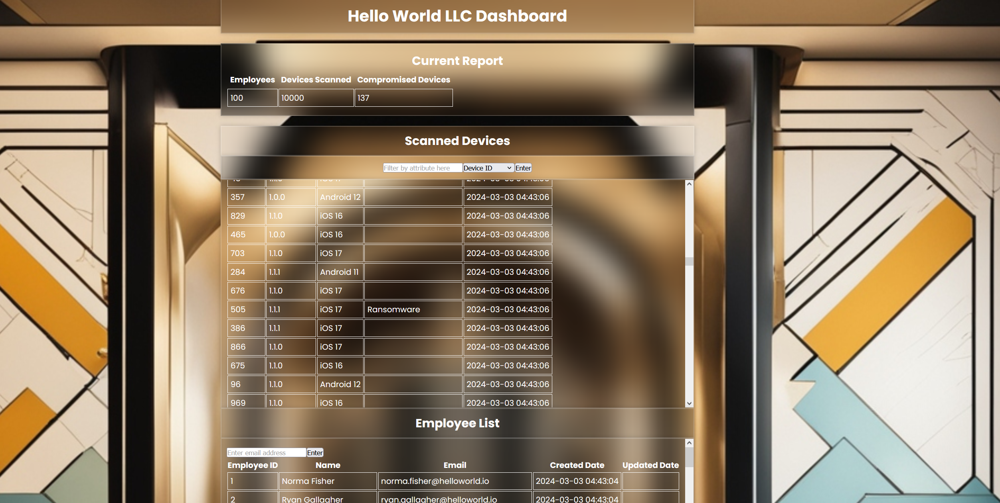
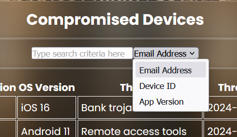
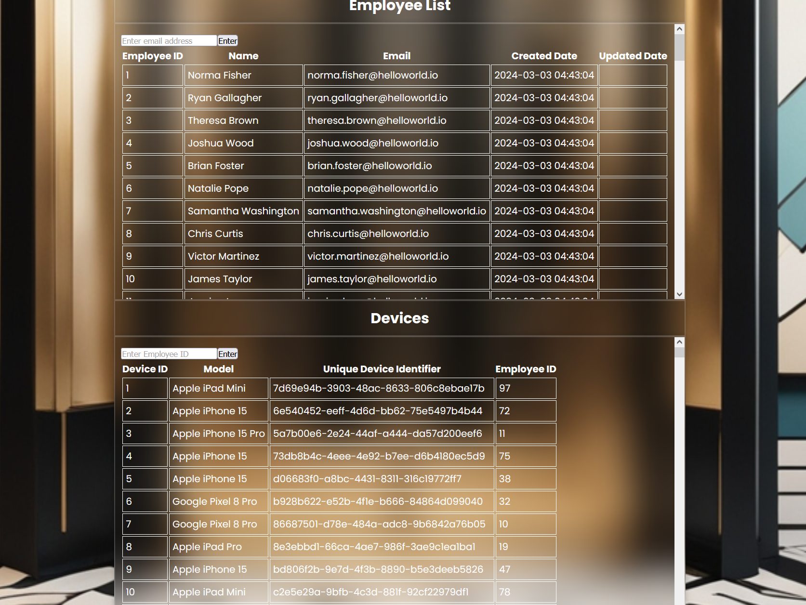

# ⚔️ Defend Me

## 📚 Table of Contents

1. [Description](#description)
2. [Functionality](#functionality)
    - [Security Considerations](#security-considerations)
    - [Login Screen](#login-screen)
    - [Enterprise Dashboard](#enterprise-dashboard)
3. [Backend APIs](#backend-apis)
    - [Postman Collection](#postman-collection)
    - [Authentication](#authentication)
    - [Core Resources](#core-resources)
4. [Developer Instructions](#developer-instructions)
    - [Local](#local)
        - [Windows](#windows-bash)
        - [Troubleshooting](#troubleshooting)
            - [Cross-Origin Request Blocked and CORS issues](#cross-origin-request-blocked-and-cors-issues)
5. [Nice to Haves / Bugs](#nice-to-haves--bugs)
6. [Credits](#credits)

## 📖 Description

This is a take-home project for a technical interview for a company.

This application is written in Python for the Flask backend and React.js for the frontend.

## Functionality

A smartphone application that scans a fictional company's employee devices for known and unknown malware.

### Security Considerations

1. Hashed passwords in the database in case a database is stolen, the passwords are hashed and salted.
2. React website is HTTPS and so is the Flask backend.
3. When a user logs in, a session ID is generated that is valid for a certain time (e.g. 1 hour) to access the private dashboard page.


### 🔑 Login Screen

The user is greeted with a login screen. This prevents anyone from accessing the Defend Me enterprise dashboard as it contains [PII](https://en.wikipedia.org/wiki/Personal_data) such as employee name, email and sensitive information.


### Enterprise Dashboard



We can filter the scans based on Email Address of the device employee owner, Device ID and App Version.





## Backend APIs

> [!NOTE]
> All API requests must be made over HTTPS. Calls made over HTTP will fail.

Ideally the API docs should come in an OpenAPI spec so it is standardised and can be used by potential devs that want to integrate with the system. It also makes a great doc!

### Postman Collection

See Postman collection [here](./demo/Defend%20Me.postman_collection.json).

### Authentication

#### Login

Authenticate user email and password.

Endpoint: POST `/login`

Request Body: 

```json
{
    "email": "firstname.lastname@helloworld.io",
    "password": "SomePasswordHere"
}
```

HTTP Status Code Summary

HTTS Status | Code Summary | Details
--- | --- | ---
200 | OK | Everything worked as expected.
400 | Bad Request | Invalid password or no password found with provided email address.
500 | Server Error | Something went wrong on Defend Me's end.

#### Logout

Log out of Defend Me.

Endpoint: POST `/logout`

Request Body: 

```json
{
    "message": "logout successful"
}
```

HTTP Status Code Summary

HTTS Status | Code Summary | Details
--- | --- | ---
200 | OK | Everything worked as expected.
400 | Bad Request | Invalid password or no password found with provided email address.
500 | Server Error | Something went wrong on Defend Me's end.

### Core Resources

#### List All Employees

Returns a list of employees.

Endpoint: GET `/employee`

Response Body: 

```json
{
    "count": 100,
    "data": [
        {
            "created_date": "2024-03-03 04:43:04",
            "email": "norma.fisher@helloworld.io",
            "employee_id": 1,
            "name": "Norma Fisher",
            "updated_date": null
        },
            ],
    "object": "list",
    "url": "/employee"
}
```

HTTP Status Code Summary

HTTS Status | Code Summary | Details
--- | --- | ---
200 | OK | Everything worked as expected.
500 | Server Error | Something went wrong on Defend Me's end.

#### Retrieve employee by email

Returns an employee by email address

Endpoint: GET `/employee`

Response Body: 

```json
{
    "data": {
        "created_date": "2024-03-03 04:43:04",
        "email": "dwayne.kirk@helloworld.io",
        "employee_id": 66,
        "name": "Dwayne Kirk",
        "updated_date": null
    }
}
```

#### List All Devices

Returns a list of devices.

Endpoint: GET `/device`

Response Body: 

```json
{
    "data": [
        {
            "device_id": 1,
            "employee_id": 97,
            "model": "Apple iPad Mini",
            "unique_device_identifier": "7d69e94b-3903-48ac-8633-806c8ebae17b"
        },
    ],
    "object": "list",
    "url": "/device"
}
```

HTTP Status Code Summary

HTTS Status | Code Summary | Details
--- | --- | ---
200 | OK | Everything worked as expected.
500 | Server Error | Something went wrong on Defend Me's end.

#### List All Scans

Returns a list of scanned devices.

Endpoint: GET `/scan`

Query Parameters:

- secure (boolean) - true or false
- app_version (string) - 1.0.0, 1.1.0, or 1.1.1 are sample data
- device_id (integer) - 1 to 1000 are sample data

Response Body: 

```json
{
    "data": [
        {
            "app_version": "1.0.0",
            "created_date": "2024-03-03 04:43:06",
            "device_id": 115,
            "os_version": "iOS 16",
            "scan_id": 6699,
            "secure": 0,
            "threats": "Cryptomining malware"
        }
    ],
    "object": "list",
    "url": "/scans"
}
```

HTTP Status Code Summary

HTTS Status | Code Summary | Details
--- | --- | ---
200 | OK | Everything worked as expected.
500 | Server Error | Something went wrong on Defend Me's end.

## 👩‍💻 Developer Instructions

### Local

#### 🖥️ Windows

> [!IMPORTANT]
> Most of the commands below are ran using Git Bash so please install it from [here](https://git-scm.com/download/win) if you do not have it yet.

1. Ensure you have Node.js and npm installed in your machine. Check by running the following commands.

```
npm -v
```

```
node -v
```

If you do not have Node.js, install from [here](https://nodejs.org/en/download).

2. Ensure you have Python installed.

```
python --version
```

or

```
python3 --version
```

If you do not have Python, go ahead and install it from [here](https://www.python.org/).

3. Ensure you have `pip` installed.

```
pip --version
```

If you do not have `pip`, go ahead and refer to this [documentation](https://pypi.org/project/pip/).

4. You will need to install Apache 24 into your local machine. Follow instructions [here](https://httpd.apache.org/docs/current/platform/windows.html#down). **Troubleshooting:** If you get this error `AH00558: httpd.exe: Could not reliably determine the server's fully qualified domain name, using ::1. Set the 'ServerName' directive globally to suppress this message`, try these commands:
    - `sql-database/schema.sql`
    - Update in the `httpd.conf` file to `ServerName localhost`. It will be commented so you have to uncomment it.
    - Once the config is updated, you will need to restart the Apache24 server.
    - `cd C:\Apache24\bin`
    - `./httpd.exe -k install`
    - `./httpd.exe -k restart`

5. Follow steps below to modify Apache configurations. 
    - Run `mod_wsgi-express module-config`. 
    - Copy and paste the output of the terminal and add it to `C:\Apache24\conf\httpd.conf` file. 
    - You will need to restart the Apache server after updating the config `./httpd.exe -k restart`.
    - Start the Apache server `mod_wsgi-express start-server`.
    - On your browser go to [http://localhost:8000/](http://localhost:8000/).


6. You will need to create an SSL certificate in your local machine if you have not already with [mkcert using Chocolatey](https://github.com/FiloSottile/mkcert?tab=readme-ov-file#windows). If you **do not** have Chocolatey, install using Powershell using command [here](https://chocolatey.org/install). Ensure the `cert.pem` and `key.pem` files are created at the top level directory of `\defend-me\react-client`.


7. Once you have Python installed, you will need these following Python packages in `requirements.txt`. Run the following command to install them.

```
pip install -r requirements.txt
```

8. Run the commands below to initialise the database with seeded data.

```
cd sql-database
```

```
python init_db.sql
```

<details>

<summary>You should see the validation print to the console. Ensure it matches like in the sample here.</summary>

```
Initialising database with schema from schema.sql!

Starting table creation and insertion validation...

SELECT COUNT(*) FROM employee
100

SELECT COUNT(*) FROM administrator
5

SELECT COUNT(*) FROM admin_access
5

SELECT COUNT(*) FROM device
1000

SELECT COUNT(*) FROM scan
10000

Finished table creation and insertion validation!

Database initialised!
```

</details>

9. Run the commands below to start the backend server.

```
cd flask-server/
```

```
python server.py
```

10. Run the commands below to install the dependencies for React and start the frontend in another bash terminal.

```
cd react-client/
```

```
npm install
```

```
npm start
```

#### Troubleshooting

##### Cross-Origin Request Blocked and CORS issues

If using Google Chrome enter `chrome://flags/#allow-insecure-localhost` and allow invalid certificates on localhost. This should be okay since it's just in our local dev environment with a self-signed SSL certificate.

## Nice to haves / Bugs

Due to time constraints of this project, there are some nice to haves and things that could be implemented such as:

1. Randomly generated timestamp for when the scan was detected. So we can show a time graph of when things were detected in the dashboard.
2. JWT token upon authentication so users can go in private pages even after they refresh the page.
3. Adding pagination to the front-end. Although I have code in the backend to do pagination for scans, I need more time to research how to do it on React.
4. Logout button.
5. Host it.
5. Hashed email and password in the frontend.


## Credits

1. [Deep AI Image Generator](https://deepai.org/machine-learning-model/text2img) for the login screen background.
2. [React Icons](https://react-icons.github.io/react-icons/) for icons used within the website.
3. [Login Form](https://www.youtube.com/watch?v=kghwFYOJiNg) for the template.